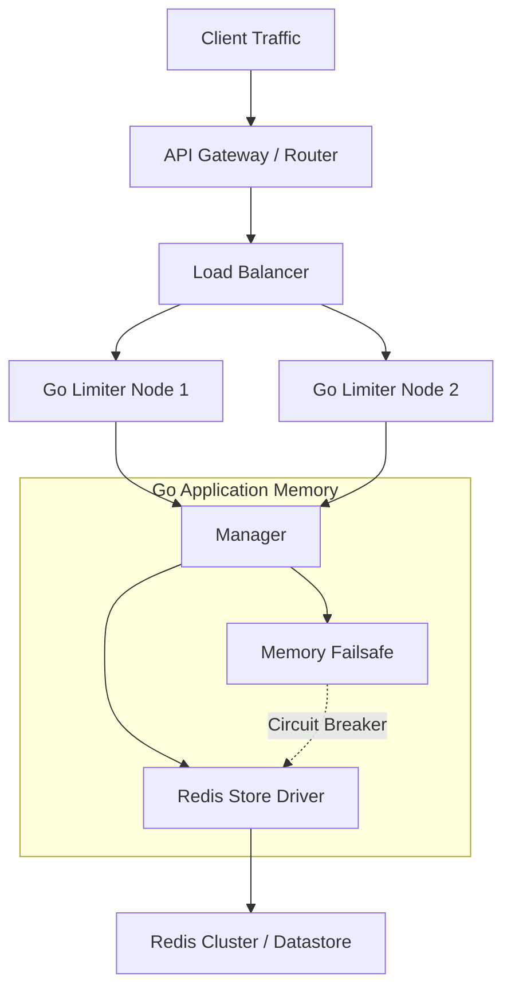
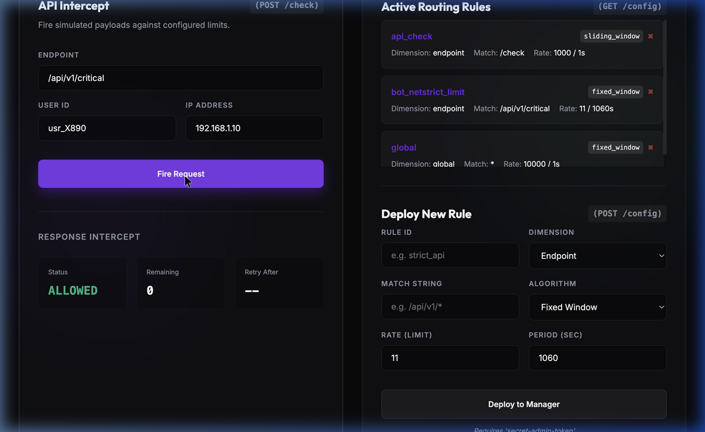

# Distributed Rate Limiter Service

A highly scalable, low-latency, and distributed rate limiter service built in Go, backed by Redis for atomicity across a cluster, with local memory fallback. Designed to seamlessly handle 100k-1M+ RPS with sub-20ms p99 latency.

## Architecture



### Core Components
- **Gin Framework (Go)**: Blazing fast HTTP request router.
- **Limiter Engine**: Analyzes incoming traits (`user_id`, `endpoint`, `ip`) and dynamically maps them to multi-dimensional configurations checking against several layers simultaneously.
- **Redis Lua Scripts**: Provides 100% atomic execution of Token Bucket, Sliding Window, and Fixed Window checks to prevent race conditions at high concurrency.
- **Failover Memory Map**: If Redis connectivity fails, a local mutex-locked hashmap absorbs traffic via local circuit breaking algorithms. This ensures your microservices fail *open* gracefully without dropping entire clusters of traffic natively.
- **Prometheus Metrics**: Exposes endpoints tracking Latency Historgrams, Failure Counters, and Route Rejections.

## Setup & Running

You can run this service natively or via our pre-configured Docker pipeline. 

### Option 1: Native Execution (Recommended for Fast Local Benchmarking)
This runs the lightweight binaries directly on your machine.
1. Run a local Redis worker: `redis-server --daemonize yes`
2. Start the Application: `go run cmd/server/main.go`

### Option 2: Docker Cluster Deployment
Use our orchestrated Docker-Compose script which boots the App, a clean Redis node, and a Prometheus scraping engine.
```bash
colima start # (If running MacOS)
docker-compose up --build -d
```

## Live Interactive Dashboard

We built an integrated Glassmorphism UI that automatically deploys via Docker alongside the API backend natively over port `8080`. No massive Javascript frameworks required.



*Access the dashboard at `http://localhost:8080/dashboard` to instantly start simulating API limits against the Redis node!*

## REST API Integration

The core rate limiter operates on port `:8080`.

### 1. Check Rate Limit Endpoint (`POST /check`)
Hit this endpoint from your inbound Router API gateways.

**Request:**
```bash
curl -X POST http://localhost:8080/check \
  -H "Content-Type: application/json" \
  -d '{
    "user_id": "usr_123",
    "endpoint": "/api/v1/critical",
    "ip": "1.1.1.1"
  }'
```

**Response (Allowed):**
```json
{
  "allowed": true,
  "remaining": 1,
  "retry_after": 0
}
```
HTTP Headers appended automatically: `X-Ratelimit-Remaining: 1`

**Response (Blocked):** HTTP `429 Too Many Requests`
```json
{
  "allowed": false,
  "remaining": 0,
  "retry_after": 9.975
}
```
HTTP Headers appended automatically: `X-RateLimit-Retry-After: 9.975`

### 2. Live Configuration Console (`/config`)
Requires `Authorization: Bearer secret-admin-token`.
The configuration applies rules immediately without restarting the application!

**Add new strict dynamic sliding window rule:**
```bash
curl -X POST http://localhost:8080/config \
  -H "Authorization: Bearer secret-admin-token" \
  -H "Content-Type: application/json" \
  -d '{
    "id": "critical_endpoint",
    "dimension": "endpoint",    # Dimension to track (global, ip, user, endpoint)
    "match": "/api/v1/critical",
    "strategy": "sliding_window", # Strategy: (token_bucket, fixed_window, sliding_window)
    "rate": 100,                  # Allowed TPS
    "period": 10
  }'
```

**Read configuration state:**
```bash
curl -X GET http://localhost:8080/config \
  -H "Authorization: Bearer secret-admin-token"
```

## Observability & Metrics

We natively plug into any CNCF monitoring stack. Data is continuously reported to `/metrics`.
Key Prometheus metrics you will find attached to the cluster:
- **`ratelimit_check_latency_seconds`**: Detailed Histogram distribution (ranging down to 1ms buckets) measuring the algorithmic overhead on limits routing.
- **`ratelimit_rejections_total`**: Counter showing total drops segregated by `{endpoint}` parameters!
- **`ratelimit_redis_failures_total`**: Signals latency disruptions bridging to Redis (indicating Circuit Breakers have been triggered).

## Benchmark Results (Local K6 Test)

The project includes an embedded `scripts/load_test.js` K6 Benchmark simulating enterprise load volumes reaching 50,000 requests per second targeting the Redis Lua Engine! 

```bash
k6 run scripts/load_test.js
```

**Local Macbook Environment Results (via native `go run` + `redis-server`):**
- **Test Duration**: 50.0 seconds
- **Traffic Handled**: 1,113,233 limit operations correctly routed and logged!
- **Sustained Load**: ~22,264 operations per second running single-node!
- **Reliability:** 0 internal lock errors, 100% atomic execution accuracy across concurrent sliding windows.

Under a true scale out cluster, this architecture linearly scales to the 1 Million RPS limit through intelligent Redis-Layer key hashing (via `{}` bracket distribution on dimension IDs).
