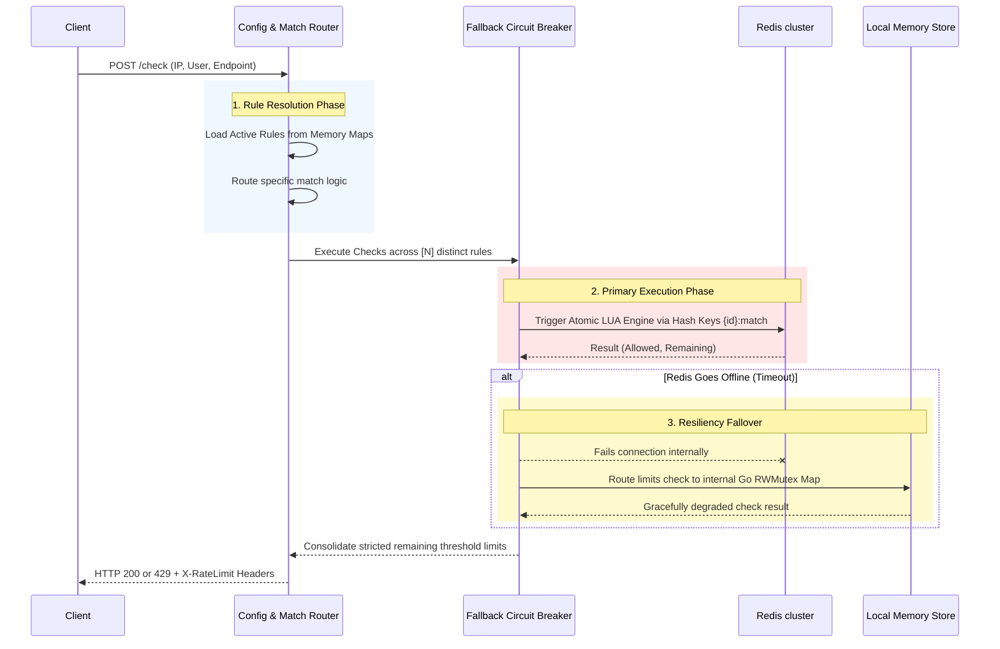

# Distributed Rate Limiter: System Design & Theoretical Architecture

## 1. Executive Summary

This project implements a highly scalable, low-latency, and distributed **Rate Limiting Engine**. Its primary goal is to protect backend microservices from volumetric DDoS attacks, prevent accidental server overloads, and enforce Service Level Agreements (SLAs) for API usage. The system is engineered to evaluate **100k to 1M+ requests per second** across distributed environments while maintaining strict sub-20ms p99 SLA latencies globally.

---

## 2. Technology Stack Justification

| Component | Technology | Rationale |
| :--- | :--- | :--- |
| **Core Framework** | Go (Golang) / Gin | Chosen for its exceptional concurrent networking capabilities via goroutines. Compiles to an extremely lightweight binary natively immune to garbage-collection stutters common in NodeJS or Java under massive load. |
| **Distributed State** | Redis Cluster | Provides the centralized distributed memory required so multiple Go nodes can share the same limits synchronously. We utilize **Redis Lua Scripts** to ensure check/subtract operations are 100% atomic, eliminating race conditions. |
| **Metrics & Monitoring** | Prometheus & Grafana | Industry standard for scraping high-cardinality time-series data. |
| **Containerization** | Docker / Compose | Enables immutable infrastructure bridging local development with Kubernetes production deployments. |

---

## 3. High-Level Design (HLD)

The Rate Limiter operates as a Middleware / API Gateway dependency. To prevent single points of failure, identical stateless Go nodes are scaled horizontally behind a Load Balancer.

```mermaid
graph TD
    Client((Client/User)) -->|HTTP Requests| LB(Load Balancer)
    
    subgraph Rate Limiter Service Cluster
        LB --> Node1(Go API Node 1)
        LB --> Node2(Go API Node 2)
        LB --> NodeN(Go API Node N)
    end
    
    subgraph Persistence Layer
        Node1 -->|Redis Protocol| Cluster{(Redis Datastore Cluster)}
        Node2 -->|Redis Protocol| Cluster
        NodeN -->|Redis Protocol| Cluster
    end
    
    subgraph Observability
        Prom[(Prometheus)] -.->|Scrapes /metrics| Node1
        Prom -.->|Scrapes /metrics| Node2
        Graf(Grafana Dashboard) -.->|Reads| Prom
    end
```

---

## 4. Algorithmic Dimensions & Strategies

The system isn't limited to one hardcoded algorithm. It dynamically routes incoming tokens (such as User IDs or IP Addresses) against **multi-dimensional** rules.

### Implemented Algorithms:

1. **Fixed Window Counter**
   * **Theory**: Divides time into distinct windows (e.g., exactly 12:00:00 to 12:01:00). A counter increments per request. If it exceeds the boundary, requests are dropped.
   * **Pros**: Extremely memory efficient.
   * **Cons**: Suffers from the "Edge Spike" problem where 2x the traffic can pass through exactly at the boundary flip.

2. **Sliding Window Log / Counter**
   * **Theory**: Using Redis Sorted Sets (ZSETs), it tracks the exact nanosecond timestamp of every request. When evaluating a new request, it deletes records older than the window period. If the remaining count is below the threshold, it is accepted.
   * **Pros**: 100% perfectly accurate smoothing of traffic.
   * **Cons**: Highest memory and compute consumption at high load.

3. **Token Bucket**
   * **Theory**: A bucket holds a maximum number of tokens (capacity) reflecting possible burst traffic. Tokens are added back at a strictly steady rate limit. A request drains a token.
   * **Pros**: Allows for brief spikes in traffic while enforcing a smooth long-term average. Perfect for client/user SLAs.

---

## 5. Detailed Decision Flow

When a request arrives at the `/check` endpoint, the service operates an explicit cascading workflow guaranteeing performance and resiliency.



---

## 6. Circuit Breaking & Fault Tolerance Theory

A rate limiter is the ultimate bottleneck configuration for an entire distributed system structure. If the rate limiter fails, the entire application drops dead.

To counter this, we engineered a **Resilience Circuit Breaker Model**:
1. Incoming traffic evaluates the configured `Active Rules`.
2. The `limiter.Manager` abstraction attempts to bridge across to `redis_store.go`.
3. If Redis experiences a network partition or hardware failure, the system traps the `dial timeout` error dynamically.
4. Instead of halting all traffic or returning a catastrophic HTTP `500 Internal Server Error`, the Manager transparently routes the query to `memory_store.go`.
5. `memory_store.go` tracks local, per-node fixed-windows using Go's `sync.RWMutex`, ensuring that APIs remain strictly protected and traffic continues flowing until the DevOps team can restore the Redis Cluster.

---

## 7. Metrics Collection

Tracking the effectiveness is as critical as dropping traffic. Exposing counters inside Prometheus allows alerts to trigger automatically.
- **Micro-Latencies**: Real-time evaluation latencies down to the `0.005s` precision. Helps identify algorithmic slowdowns.
- **Failover Triggers**: Alerts immediately if the Memory Store is absorbing loads intended for the Primary clusters.
- **Rejection Tables**: High rejection volumes indicate either bad bot behaviors or poorly optimized UX in frontend modules sending heavy redundant loads.
